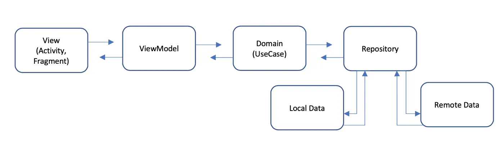

# Handy Men

Dans ce TP, nous allons une application de mise en relation entre particuliers. L'objectif est de développer
une application mobile permettant à des utilisateurs de proposer des services (aka des bricolleurs) 
et à d'autres de solliciter des services. 

## V0 : Faire fonctionner la base du code
>> Les données sont gérées en mémoire
- Récupérer et afficher une liste de bricolleurs (gérée en mémoire)
- Faire les opérations CRUD sur les bricolleurs (add, get, edit, delete)
- Consulter le détail
- Ajouter/Supprimer un utilisateur dans les favoris
- Afficher ses favoris
- Partager le profil d'un bricoller (via SMS, email, etc.)
- Visiter la page d'un bricolleur (Facebook, LinkedIn, etc.)
- Rechercher (par nom, phone, etc.)
- Trier (par nom, date de création, etc.)

## Architecture du code

L'application doit respecter le principe de clean architecture. Pour cela, nous allons organiser
notre code dans deux modules distincts :

- `app` : Contient le code spécifique à l'application (UI, logique liée à la vue, etc.)
- `data` : Contient le code métier de l'application (entités, services, repositories, etc.)

### Schéma d'architecture

- View/Activity/Fragment : Cette couche permet de générer l'interface graphique de l'application.
- ViewModel : Manipule les données utilisées dans les vues.
- LiveData : Permet de notifier les vues lorsque les données changent ou deviennent disponibles.
- UseCase : Cette couche gère la logique de récupération des données pour les vues. Les
  use cases sont utilisés pour récupérer les données dans les repositories et les transformer en
  modèles spécifiques aux vues.
- Repository : Composant médiateur permettant de récupérer les données dans les différentes sources.
- DataSource : Couche de traitement des données spécifiques à une source de données (API, base de
  données, etc.)

## Librairies utilisées
- ViewModel
- LiveData
- Navigation

## Votre travail
Implementer la version V0 de l'application en respectant les étapes suivantes :

### Étape 1 : Prise en main du projet
- Importez le projet dans Android Studio et lancez l'application. Vous avez déjà une base de code
  permettant de gérer la navigation et l'affichage des utilisateurs.
- Il est probable que vous rencontriez des erreurs de compilation. Identifiez et corrigez-les.
- Ajouter une toolbar à l'activité principale.
- Remplacer les icons de la barre de navigation par des icons plus adaptés. 
- Gérer au moins deux langues (français et anglais) pour tous les textes de l'application.

### Étape 2 : Optimiser la liste des utilisateurs

- Complétez la vue liste en ajoutant d'autres données (photo, bio, icônes (likes, suppression, ...), etc.)
- Ajoutez un fragment pour afficher le détail d'un utilisateur.
- Supprimez un utilisateur de la liste (depuis la liste ou dans la vue de détail).

### Étape 3 : Gestion des favoris

- Ajoutez/supprimez un utilisateur en favoris (à partir de la liste ou dans la vue de détail).
- Affichez la liste des utilisateurs favoris.

### Étape 4 : Ajouter des utilisateurs
- Ajoutez un fragment permettant de créer un utilisateur.

### Étape 5 : Partager le profil d'un utilisateur
- Partagez le profil d'un utilisateur (via SMS, email, etc.)
- Consultez le profil d'un utilisateur sur un réseau social (Facebook, LinkedIn, etc.)

### Étape 6 : Rechercher et trier les utilisateurs
- Mise en place d'une bar de recherche multi-critaires (par nom, phone, etc.)
- Triez la liste (par nom, date de création, etc.)

### Étape 7 : Injection de dépendances
- Utilisez la librairie Dagger Hilt pour gérer plus efficacement l'injection de dépendances.
